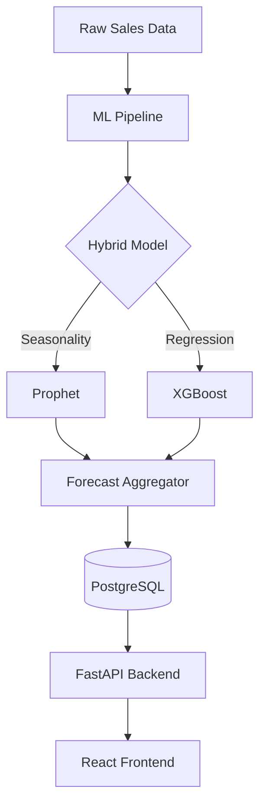

# SmartStock AI: Warehouse Demand Forecasting & Auto-Replenishment 📦🚀

[](https://github.com/USER_NAME/REPO_NAME/actions/workflows/ci.yml)
[](https://ghcr.io/)
[](https://www.python.org/downloads/release/python-3110/)

**SmartStock AI** is a state-of-the-art inventory management platform that combines high-performance Time-Series analysis with Gradient Boosted Regression to automate warehouse replenishment.

---

## 🌟 Key Features

- **Hybrid AI Engine**: Dual-model approach using **Facebook Prophet** for long-term seasonality and **XGBoost** for short-term recursive forecasting.
- **Auto-Replenishment**: Intelligent reordering logic based on safety stock, lead times, and predicted demand.
- **Interactive Dashboards**: Real-time visualization of stock levels, demand trends, and critical reorder alerts.
- **Enterprise-Ready Infrastructure**: Fully containerized with Docker, featuring an asynchronous FastAPI backend and a Postgres database.
- **CI/CD with ML Gates**: Automated GitHub Actions pipeline that validates model accuracy (MAPE) before every deployment.

---

## 🧪 Technical Deep Dive

### 1. Hybrid ML Strategy
The system processes over **2,000 SKUs** using two distinct approaches:
- **Prophet Forecaster**: Configured with *Multiplicative Seasonality* to handle complex yearly and weekly cycles. It incorporates custom regressors for promotions and holidays.
- **XGBoost Regressor**: Uses a *Recursive Multi-step* approach. It generates features on-the-fly (Lags, Rolling Means) and feeds its own predictions back into the model to forecast up to 30 days ahead.

### 2. Feature Engineering
Our pipeline automatically generates:
- **Lags**: 7, 14, and 30-day historical sales offsets.
- **Rolling Windows**: 7-day and 30-day moving averages and standard deviations.
- **Temporal Features**: Day of week, month, and holiday flags to capture cyclical demand spikes.

---

## 🏗️ System Architecture



---

## 🚀 Installation & Setup

### Requirements
- [Docker Desktop](https://www.docker.com/products/docker-desktop)
- [TablePlus](https://tableplus.com/) (Optional - for DB inspection)

### Local Deployment
1. **Clone the repository**:
   ```bash
   git clone https://github.com/your-username/smartstock-ai.git
   cd smartstock-ai
   ```
2. **Launch with Docker**:
   ```bash
   docker-compose up --build -d
   ```
3. **Access Services**:
   - **Frontend**: [http://localhost:3000](http://localhost:3000)
   - **API Docs**: [http://localhost:8000/docs](http://localhost:8000/docs)

---

## 🛠️ DevOps & CI/CD
Our GitHub Actions pipeline (`ci.yml`) ensures production stability through:
- **Linting**: Automated code quality checks using `ruff`.
- **MAPE Gate**: A validation step that fails the build if the ML model's Mean Absolute Percentage Error (MAPE) exceeds professional thresholds.
- **Registry Integration**: Successful builds are automatically pushed to the **GitHub Container Registry (GHCR)** as production-ready images.

---

## 📄 License & Contact
Distributed under the MIT License. See `LICENSE` for more information.

**Author**: Nitin Johri
**Project Link**: [https://github.com/your-username/smartstock-ai](https://github.com/your-username/smartstock-ai)
