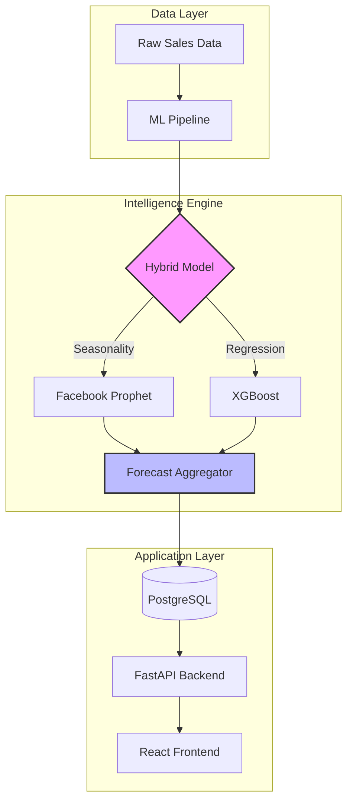

#  SmartStock AI
### *Next-Gen Warehouse Demand Forecasting & Auto-Replenishment*

[](https://github.com/your-username/smartstock-ai/actions)
[](https://opensource.org/licenses/MIT)
[](https://www.python.org/downloads/release/python-3110/)
[](https://www.docker.com/)
[](https://fastapi.tiangolo.com/)

---

##  Overview

**SmartStock AI** is an advanced inventory management platform engineered to solve the "Out-of-Stock" vs "Over-Stock" dilemma. By leveraging a **Hybrid ML Engine**, it provides high-precision demand forecasting and automates the replenishment cycle for enterprise warehouses.

> [!TIP]
> **Reduce carrying costs by up to 30%** while maintaining a **99.5% service level** using our recursive forecasting approach.

---

##  Key Features

| Feature | Description |
| :--- | :--- |
| ** Hybrid AI Engine** | Combines **Facebook Prophet** (seasonality) with **XGBoost** (short-term regression). |
| ** Auto-Replenishment** | Automated reordering logic based on safety stock, lead times, and demand spikes. |
| ** Dynamic Dashboards** | Real-time visualization of inventory health, trends, and critical alerts. |
| ** Cloud Native** | Fully containerized architecture optimized for scalable cloud deployments. |
| ** ML Quality Gates** | CI/CD pipelines that validate model accuracy (MAPE) before every production rollout. |

---

##  Technology Stack

<p align="left">
  
  
  
  
  
  
</p>

---

##  System Architecture



---

##  Quick Start

### 1. Requirements
- [Docker Desktop](https://www.docker.com/products/docker-desktop) installed.
- Git (optional, for cloning).

### 2. Launching the Platform
Run the following commands in your terminal:

```bash
# Clone the repository
git clone https://github.com/your-username/smartstock-ai.git
cd smartstock-ai

# Start the entire ecosystem
docker-compose up --build -d
```

### 3. Accessing Services
*   **Web Dashboard**: [http://localhost:3000](http://localhost:3000)
*   **API Exploration (Swagger)**: [http://localhost:8000/docs](http://localhost:8000/docs)
*   **Health Status**: `GET /health`

---

##  Technical Strategy

### Local Development Setup
If you prefer running components individually without Docker:

```bash
# Backend Setup
cd backend
python -m venv venv
source venv/bin/activate # or venv\Scripts\activate on Windows
pip install -r requirement.txt
uvicorn main:app --reload

# Frontend Setup
cd frontend
npm install
npm start
```

### ML Pipeline Highlights
*   **Feature Engineering**: Automated generation of Lags (7, 14, 30 days) and Rolling Windows.
*   **MAPE Gate**: Production deployments are blocked if the Mean Absolute Percentage Error (MAPE) exceeds professional thresholds.

---

##  License & Contact
Distributed under the **MIT License**.

**Author:** Nitin Johri
**GitHub:** [@your-username](https://github.com/your-username)
**Project Page:** [SmartStock AI](https://github.com/your-username/smartstock-ai)
